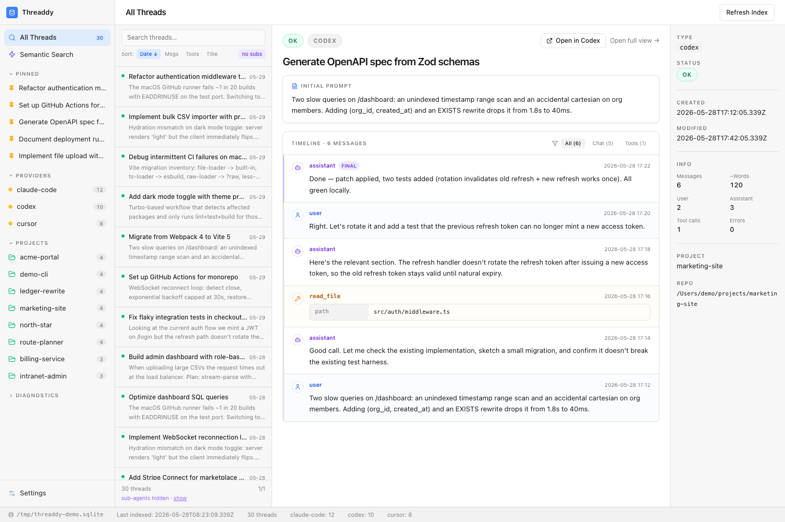

# Threaddy

**A local-first dashboard for your AI agent conversations.**

Threaddy indexes conversation threads from Claude Code, Codex, and Cursor into a local SQLite database and serves a fast, searchable web UI. All data stays on your machine.



- **All your AI conversations in one place** — Claude Code, Codex, and Cursor unified into one searchable index
- **Cross-provider Pinned section** — pins are auto-imported from each app's own storage (Codex `pinned-thread-ids`, Cursor `cursor/pinnedComposers`, Claude desktop `starredIds`) and refreshed live
- **Hybrid search** — full-text (FTS) over message content + semantic (local embeddings) + fuzzy matching on project / title / provider, so `kuba cooks` finds the `kuba-cooks` project
- **"Open in app" deep links** — jump straight from a Threaddy thread into the source app: `codex://threads/<id>` for Codex, `claude://resume?session=<id>` for Claude Code
- **Live sync** — a file watcher (default-on) picks up new sessions and pin changes within seconds; pin changes trigger a cheap pin-only sync instead of a full reindex
- **Agent-ready** — a built-in [MCP server](#use-from-agents-mcp) exposes search, get-thread, pinned, and find-related tools to any MCP-capable agent
- **Single compiled binary** — no runtime dependencies; all data stays local

---

## Install

### macOS / Linux — one-liner

```bash
curl -fsSL https://raw.githubusercontent.com/benedyktdryl/threaddy/main/install.sh | bash
```

This auto-detects your OS and architecture, downloads the right binary from the latest GitHub Release, and installs it to `/usr/local/bin/threaddy`.

Override the install directory or version:

```bash
THREADDY_INSTALL_DIR=~/.local/bin THREADDY_VERSION=v0.2.0 \
  curl -fsSL https://raw.githubusercontent.com/benedyktdryl/threaddy/main/install.sh | bash
```

### Direct download

Download the pre-built binary for your platform from [GitHub Releases](https://github.com/benedyktdryl/threaddy/releases/latest):

| Platform | Binary |
|---|---|
| macOS Apple Silicon | `threaddy-macos-arm64` |
| macOS Intel | `threaddy-macos-x64` |
| Linux x86_64 | `threaddy-linux-x64` |
| Linux ARM64 | `threaddy-linux-arm64` |

```bash
# Example: macOS Apple Silicon
curl -fsSL https://github.com/benedyktdryl/threaddy/releases/latest/download/threaddy-macos-arm64 \
  -o threaddy
chmod +x threaddy
sudo mv threaddy /usr/local/bin/
```

### Build from source

Requires [Bun](https://bun.sh) ≥ 1.1.

```bash
git clone https://github.com/benedyktdryl/threaddy.git
cd threaddy
bun install
bun run build        # → dist/threaddy (current platform)
```

---

## Quick start

```bash
# 1. Create a config file (~/.config/threaddy/config.json)
threaddy init

# 2. Index your threads
threaddy reindex

# 3. Open the web UI
threaddy serve
# → Server running at http://localhost:4821
```

Open [http://localhost:4821](http://localhost:4821) in your browser. That's it.

---

## Commands

| Command | Description |
|---|---|
| `threaddy init` | Create a default config file |
| `threaddy serve` | Start the web UI (port 4821 by default) |
| `threaddy reindex [provider]` | Re-index all providers, or just one |
| `threaddy reindex --semantic` | Re-generate semantic embeddings only |
| `threaddy scan [--json]` | Discover provider data without indexing |
| `threaddy search "<query>"` | Search from the CLI |
| `threaddy stats` | Print database statistics as JSON |
| `threaddy doctor [--json]` | Diagnose config, providers, and index state |
| `threaddy mcp` | Run the MCP server over stdio (for agents — see [below](#use-from-agents-mcp)) |

### `reindex`

```bash
threaddy reindex                     # all providers
threaddy reindex claude-code         # just Claude Code
threaddy reindex codex
threaddy reindex cursor
threaddy reindex --semantic          # regenerate embeddings only
```

### `search`

```bash
threaddy search "fix authentication bug"
threaddy search "refactor to typescript" --mode=semantic
threaddy search "docker compose" --mode=keyword
```

Modes: `hybrid` (default), `semantic`, `keyword`.

### `serve`

The web server starts with live sync enabled (if configured). In the UI you can:

- Browse and filter all threads by provider, project, status, or pinned-only (`?pinned=true`)
- Hybrid / semantic / keyword search with fuzzy metadata matching
- See your **Pinned** threads from every provider in one sidebar section
- Per-thread message timeline with tool-call details
- Click **Open in Codex** / **Open in Claude** to jump straight into the source app
- Saved filter bookmarks and a built-in settings editor

---

## Configuration

Config is stored at `~/.config/threaddy/config.json`. Run `threaddy init` to create a default one, or edit it in the web UI under **Settings**.

```jsonc
{
  "dbPath": "~/.local/share/threaddy/index.sqlite",
  "server": {
    "host": "127.0.0.1",
    "port": 4821
  },
  "providers": {
    "claudeCode": { "enabled": true, "roots": [] },
    "codex":      { "enabled": true, "roots": [] },
    "cursor":     { "enabled": true, "roots": [] }
  },
  "watch": {
    "enabled": true,
    "debounceMs": 1000
  },
  "semanticSearch": {
    "enabled": true,
    "model": "Xenova/all-MiniLM-L6-v2",
    "mode": "hybrid"
  },
  "excludes": ["**/node_modules/**", "**/.git/**"]
}
```

| Field | Default | Description |
|---|---|---|
| `dbPath` | `~/.local/share/threaddy/index.sqlite` | SQLite database path |
| `server.port` | `4821` | HTTP port |
| `server.host` | `127.0.0.1` | Bind address |
| `watch.enabled` | `true` | Watch provider dirs and pin-state files for changes |
| `watch.debounceMs` | `1000` | Watcher debounce |
| `semanticSearch.enabled` | `true` | Enable vector embeddings |
| `semanticSearch.model` | `Xenova/all-MiniLM-L6-v2` | Embedding model (downloaded on first use) |
| `semanticSearch.mode` | `hybrid` | Default search mode |
| `excludes` | `["**/node_modules/**"]` | Glob patterns to exclude |

### Custom provider roots

By default each provider scans its standard data directory. Override with explicit paths:

```json
"providers": {
  "claudeCode": {
    "enabled": true,
    "roots": ["/path/to/custom/.claude/projects"]
  }
}
```

---

## Providers

### Claude Code

Indexes conversation transcripts from `~/.claude/projects/**/*.jsonl`.

### Codex

Indexes session transcripts from `~/.codex/sessions/**.jsonl` and enriches metadata from `~/.codex/state_5.sqlite` when available.

### Cursor

Indexes composer sessions from `~/Library/Application Support/Cursor/User/globalStorage/state.vscdb` (macOS) or the equivalent path on Linux.

---

## Semantic search

When `semanticSearch.enabled` is `true`, Threaddy generates vector embeddings for each thread using a small local model (`all-MiniLM-L6-v2`, ~23 MB, downloaded once to `~/.cache/huggingface/hub`). Embeddings are stored as BLOBs in SQLite — no external vector database needed.

Embedding generation is triggered by `reindex` or `reindex --semantic`. The web UI's semantic search and "related threads" feature use these embeddings.

> **Note on compiled binaries**: The embedding model uses `@huggingface/transformers` with the ONNX runtime. If semantic indexing fails in the pre-built binary on your platform, run Threaddy from source with `bun run dev` or disable semantic search in config.

---

## Use from agents (MCP)

Threaddy ships a [Model Context Protocol](https://modelcontextprotocol.io) server that exposes your aggregated archive to any MCP-capable agent (Claude Desktop, Codex, custom clients). Conceptually it's a *historical archive*, complementary to curated-memory tools like mem0 — agents can search and retrieve from every conversation you've ever had with any agent on this machine.

### Tools

| Tool | What it returns |
|---|---|
| `search_threads(query, mode?, provider?, project?, pinned?, limit?)` | Top matches across all providers — metadata + short snippet only |
| `get_thread(threadId, messageLimit?, messageOffset?, includeFullContent?)` | One thread's paginated message timeline (previews by default) |
| `list_pinned(provider?, limit?)` | Cross-provider pinned threads |
| `find_related(threadId, limit?)` | Semantically similar threads (via stored embeddings) |

Every result that names a thread includes an `openInApp` field — the deep-link URL (`codex://threads/...`, `claude://resume?session=...`) so the agent can suggest opening the conversation in its source app. Snippets are capped to ~280 chars; full message bodies are only returned when `get_thread` is called with `includeFullContent: true`, to keep agent context lean.

### Setup

Run the server over stdio:

```bash
threaddy mcp
```

Then point your MCP client at it. Example for Claude Desktop (`~/Library/Application Support/Claude/claude_desktop_config.json`) or any compatible client:

```json
{
  "mcpServers": {
    "threaddy": {
      "command": "threaddy",
      "args": ["mcp"]
    }
  }
}
```

Building from source? Use Bun directly:

```json
{
  "mcpServers": {
    "threaddy": {
      "command": "bun",
      "args": ["run", "/absolute/path/to/threaddy/src/main.ts", "mcp"]
    }
  }
}
```

The server is read-only and uses the same database as `threaddy serve` — they coexist via SQLite's WAL mode.

### Example agent usage

> *"Did I solve this kind of bug before? Search my Threaddy archive for `intermittent CI failures`."*
> → agent calls `search_threads({ query: "intermittent CI failures", mode: "hybrid", limit: 5 })`, picks the relevant hit, opens via the `openInApp` deep link or fetches the timeline with `get_thread`.

---

## Running continuously (serve + watch)

Enable `watch.enabled` in config, then run `threaddy serve`. The watcher monitors provider directories and re-indexes incrementally on change — new sessions appear in the UI within seconds.

For a persistent background service, use your OS's process manager.

**launchd (macOS)**:

```xml
<!-- ~/Library/LaunchAgents/com.threaddy.plist -->
<?xml version="1.0" encoding="UTF-8"?>
<!DOCTYPE plist PUBLIC "-//Apple//DTD PLIST 1.0//EN"
  "http://www.apple.com/DTDs/PropertyList-1.0.dtd">
<plist version="1.0">
<dict>
  <key>Label</key>             <string>com.threaddy</string>
  <key>ProgramArguments</key>  <array><string>/usr/local/bin/threaddy</string><string>serve</string></array>
  <key>RunAtLoad</key>         <true/>
  <key>KeepAlive</key>         <true/>
  <key>StandardOutPath</key>   <string>/tmp/threaddy.log</string>
  <key>StandardErrorPath</key> <string>/tmp/threaddy.log</string>
</dict>
</plist>
```

```bash
launchctl load ~/Library/LaunchAgents/com.threaddy.plist
```

**systemd (Linux)**:

```ini
# ~/.config/systemd/user/threaddy.service
[Unit]
Description=Threaddy thread browser
After=network.target

[Service]
ExecStart=/usr/local/bin/threaddy serve
Restart=on-failure

[Install]
WantedBy=default.target
```

```bash
systemctl --user enable --now threaddy
```

---

## Contributing

See [CONTRIBUTING.md](CONTRIBUTING.md).

## License

[MIT](LICENSE)
